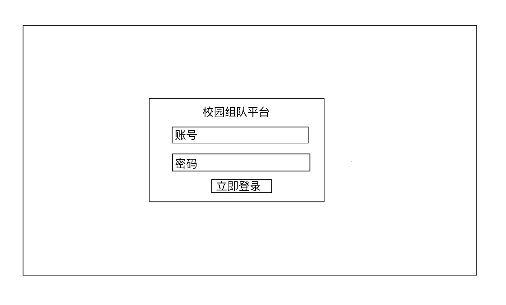
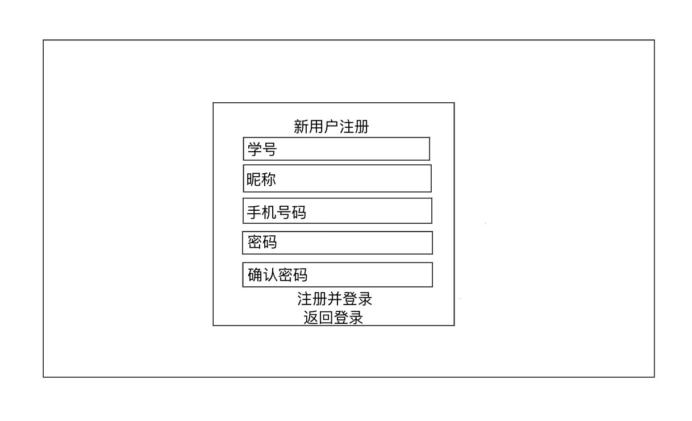
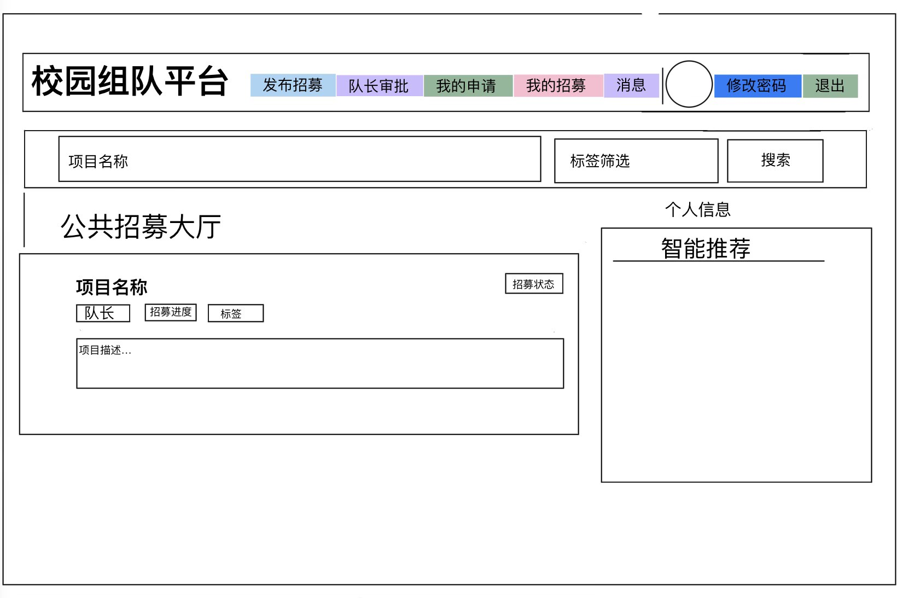

# 校园组队平台 - 界面设计说明

## 1. 用户登录界面

### 设计理由
1. 极简聚焦，降低用户决策成本：页面仅保留账号、密码、登录按钮三个核心元素，无多余干扰信息，用户可快速定位操作入口。
2. 场景适配，贴合校园用户习惯：账号字段与后续注册界面的「学号」字段统一，既符合校园平台的身份校验逻辑，也减少用户记忆负担。
3. 视觉居中，适配多终端：登录框居中布局，在不同屏幕尺寸下均能保证操作入口的清晰可见，提升使用体验。

---

## 2. 新用户注册界面

### 设计理由
1. 字段设计，兼顾身份校验与隐私保护：
   学号：作为校园平台的核心身份凭证，用于账号唯一标识与后续权限校验。
   昵称：保护用户真实隐私，组队协作时无需暴露个人信息。
   手机号码：用于后续密码找回、组队通知与消息提醒，保障协作沟通顺畅。
   密码+确认密码：双重校验机制，避免用户输入错误，保障账号安全。
2. 操作流程，减少冗余步骤：「注册并登录」按钮直接完成注册+登录的连贯操作，无需重复跳转登录页；「返回登录」按钮为已有用户提供快速退出路径。
3. 垂直表单布局，符合用户操作习惯：输入框从上到下按填写顺序排列，与用户阅读、输入逻辑一致，降低操作成本。

---

## 3. 公共招募大厅主界面

### 设计理由
1. 顶部导航栏，角色功能权责清晰：
   发布招募：为队长提供快速发起项目的入口，是平台核心供给功能。
   队长审批：专属入口处理成员申请，实现组队流程闭环管理。
   我的申请：成员查看申请进度，解决“申请状态不透明”的痛点。
   我的招募：队长管理项目信息、招募状态，方便项目维护。
   消息模块：处理组队通知、审批结果与项目沟通，保障协作信息同步。
2. 搜索+标签筛选，提升项目匹配效率：支持项目名称关键词搜索与多维度标签筛选，解决校园项目分类多样、用户需求分散的问题，帮助用户快速定位目标项目。
3. 项目卡片信息层级清晰：每个项目卡片直接展示项目名称、队长、招募进度、标签、项目描述与招募状态，用户无需进入详情页即可判断项目匹配度，减少无效点击。
4. 智能推荐模块，提升平台使用率：基于用户标签、历史申请记录推荐适配项目，解决用户“不知道找什么项目”的问题，提升组队成功率。
5. 整体布局贴合用户操作路径：从导航入口到搜索筛选，再到项目大厅与智能推荐，完全匹配用户“找项目-看项目-申请加入”的操作流程，逻辑连贯，上手无门槛。
