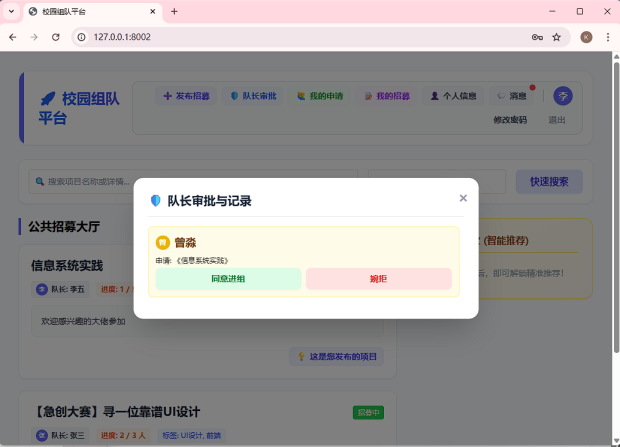
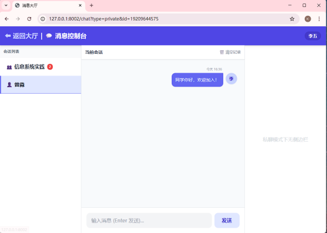

## 四、系统实现

### 1. 关键技术

| 技术 | 应用场景 |
|------|----------|
| **FastAPI异步框架** | 构建RESTful API接口，支持异步请求处理与自动文档生成 |
| **SQLite轻量级数据库** | 数据持久化存储，免配置部署，支持多表关联查询 |
| **Session + Cookie会话管理** | 用户登录状态维护，生成唯一session_id存入cookie |
| **多端互斥登录** | 新设备登录时删除旧设备session，实现“顶号”强制下线 |
| **SHA256密码加密** | 用户密码存储前进行哈希加密，保障账号安全 |
| **轮询消息推送** | 前端每2.5秒轮询后端接口，实现消息实时通知与红点提醒 |
| **Markdown实时渲染** | 前端使用marked.js库将项目描述渲染为HTML |
| **Ajax异步表单提交** | 所有表单通过fetch API异步提交，无需刷新页面 |
| **智能推荐算法** | 基于用户技能标签与项目标签的模糊匹配（子串包含+大小写归一化） |

### 2. 界面展示


*图1：登录页面，支持学号/手机号两种登录方式*


*图2：注册页面，需填写学号(12位)、姓名、手机号、密码*


*图3：个人信息管理页面，填写技能标签用于智能推荐*


*图4：招募大厅主界面，左侧项目卡片，右侧智能推荐面板*


*图5：发布招募弹窗，支持Markdown描述*



*图6：队长审批弹窗，显示待审核成员及荣誉信息*



*图7：消息聊天页面，左侧会话列表，右侧聊天区域，群聊模式下显示成员面板*

### 3. 核心代码片段

**多端互斥登录（顶号）实现：**

```python
@app.post("/do_login")
async def do_login(username: str = Form(...), password: str = Form(...)):
    new_sess = generate_session_id()
    with sqlite3.connect(DB_FILE, timeout=10) as conn:
        user = conn.cursor().execute(
            "SELECT phone FROM users WHERE (phone=? OR student_id=?) AND password=?",
            (username, username, hash_password(password))
        ).fetchone()
        if user:
            phone = user[0]
            # 关键：删除该用户所有旧session，实现互斥登录
            conn.execute("DELETE FROM user_sessions WHERE phone = ?", (phone,))
            conn.execute("INSERT INTO user_sessions (session_id, phone) VALUES (?, ?)", (new_sess, phone))
            conn.commit()
            res = RedirectResponse(url="/", status_code=303)
            res.set_cookie("session_token", new_sess, max_age=604800)
            return res
        return alert_and_redirect("❌ 账号或密码错误！", "/login")
```

---
